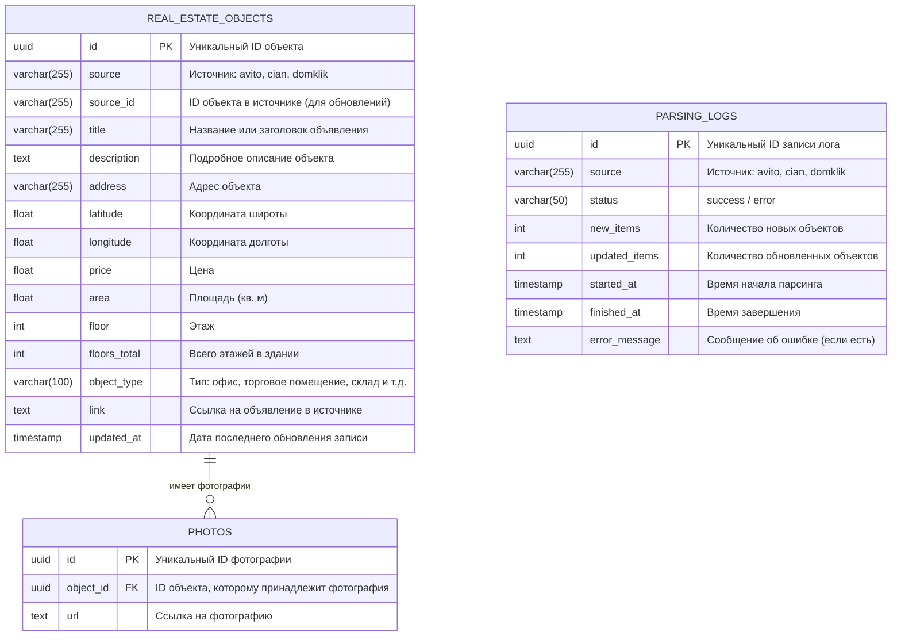

```mermaid
erDiagram

    REAL_ESTATE_OBJECTS ||--o{ PHOTOS : "имеет фотографии"

    REAL_ESTATE_OBJECTS {
        uuid id PK "Уникальный ID объекта"
        varchar(255) source "Источник: avito, cian, domklik"
        varchar(255) source_id "ID объекта в источнике (для обновлений)"
        varchar(255) title "Название или заголовок объявления"
        text description "Подробное описание объекта"
        varchar(255) address "Адрес объекта"
        float latitude "Координата широты"
        float longitude "Координата долготы"
        float price "Цена"
        float area "Площадь (кв. м)"
        int floor "Этаж"
        int floors_total "Всего этажей в здании"
        varchar(100) object_type "Тип: офис, торговое помещение, склад и т.д."
        text link "Ссылка на объявление в источнике"
        timestamp updated_at "Дата последнего обновления записи"
    }

    PHOTOS {
        uuid id PK "Уникальный ID фотографии"
        uuid object_id FK "ID объекта, которому принадлежит фотография"
        text url "Ссылка на фотографию"
    }

    PARSING_LOGS {
        uuid id PK "Уникальный ID записи лога"
        varchar(255) source "Источник: avito, cian, domklik"
        varchar(50) status "success / error"
        int new_items "Количество новых объектов"
        int updated_items "Количество обновленных объектов"
        timestamp started_at "Время начала парсинга"
        timestamp finished_at "Время завершения"
        text error_message "Сообщение об ошибке (если есть)"
    }
```
