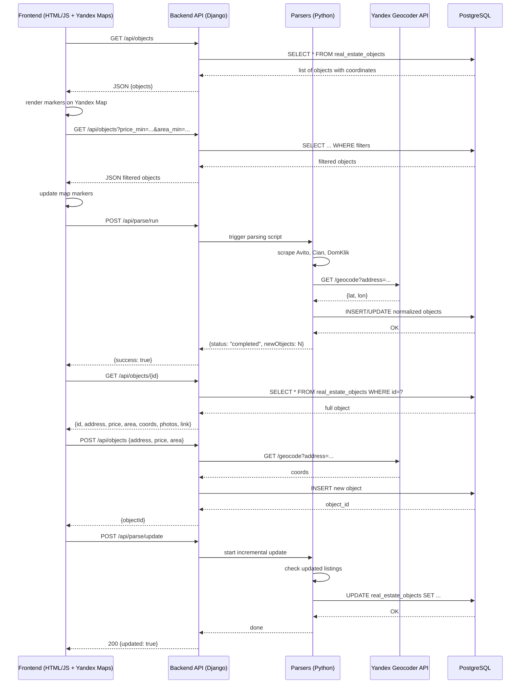

```mermaid
sequenceDiagram
    participant Front as Frontend (HTML/JS + Yandex Maps)
    participant API as Backend API (Django)
    participant Parser as Parsers (Python)
    participant Geo as Yandex Geocoder API
    participant DB as PostgreSQL


    %% === Запуск и загрузка карты ===
    Front->>API: GET /api/objects
    API->>DB: SELECT * FROM real_estate_objects
    DB-->>API: list of objects with coordinates
    API-->>Front: JSON {objects}
    Front->>Front: render markers on Yandex Map


    %% === Фильтрация на странице ===
    Front->>API: GET /api/objects?price_min=...&area_min=...
    API->>DB: SELECT ... WHERE filters
    DB-->>API: filtered objects
    API-->>Front: JSON filtered objects
    Front->>Front: update map markers


    %% === Старт парсинга объектов ===
    Front->>API: POST /api/parse/run
    API->>Parser: trigger parsing script
    Parser->>Parser: scrape Avito, Cian, DomKlik
    Parser->>Geo: GET /geocode?address=...
    Geo-->>Parser: {lat, lon}
    Parser->>DB: INSERT/UPDATE normalized objects
    DB-->>Parser: OK
    Parser-->>API: {status: "completed", newObjects: N}
    API-->>Front: {success: true}


    %% === Получение детальной информации по объекту ===
    Front->>API: GET /api/objects/{id}
    API->>DB: SELECT * FROM real_estate_objects WHERE id=?
    DB-->>API: full object
    API-->>Front: {id, address, price, area, coords, photos, link}


    %% === Добавление объекта вручную (опционально) ===
    Front->>API: POST /api/objects {address, price, area}
    API->>Geo: GET /geocode?address=...
    Geo-->>API: coords
    API->>DB: INSERT new object
    DB-->>API: object_id
    API-->>Front: {objectId}


    %% === Обновление данных по объектам ===
    Front->>API: POST /api/parse/update
    API->>Parser: start incremental update
    Parser->>Parser: check updated listings
    Parser->>DB: UPDATE real_estate_objects SET ...
    DB-->>Parser: OK
    Parser-->>API: done
    API-->>Front: 200 {updated: true}
```