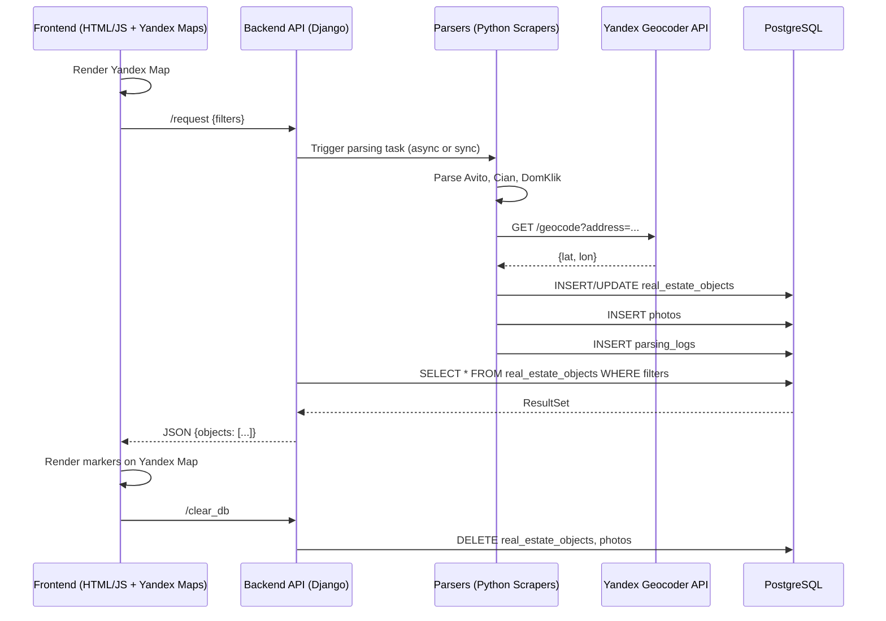

```mermaid
sequenceDiagram
    participant Front as Frontend (HTML/JS + Yandex Maps)
    participant API as Backend API (Django)
    participant Parser as Parsers (Python Scrapers)
    participant Geo as Yandex Geocoder API
    participant DB as PostgreSQL

    %% === Старт работы ===
    Front ->> Front: Render Yandex Map

    %% === Пользователь вводит требования банка ===
    Front ->> API: /request {filters}

    API ->> Parser: Trigger parsing task (async or sync)
    Parser ->> Parser: Parse Avito, Cian, DomKlik

    %% === Геокодирование ===
    Parser ->> Geo: GET /geocode?address=...
    Geo -->> Parser: {lat, lon}

    %% === Сохранение ===
    Parser ->> DB: INSERT/UPDATE real_estate_objects
    Parser ->> DB: INSERT photos
    Parser ->> DB: INSERT parsing_logs

    %% === API запрашивает данные для фронта ===
    API ->> DB: SELECT * FROM real_estate_objects WHERE filters
    DB -->> API: ResultSet

    %% === Ответ на фронт ===
    API -->> Front: JSON {objects: [...]}

    %% === Отображение на карте ===
    Front ->> Front: Render markers on Yandex Map

    %% === Отчистка БД после закрытия запроса ===
    Front ->> API: /clear_db
    API ->> DB: DELETE real_estate_objects, photos

```
