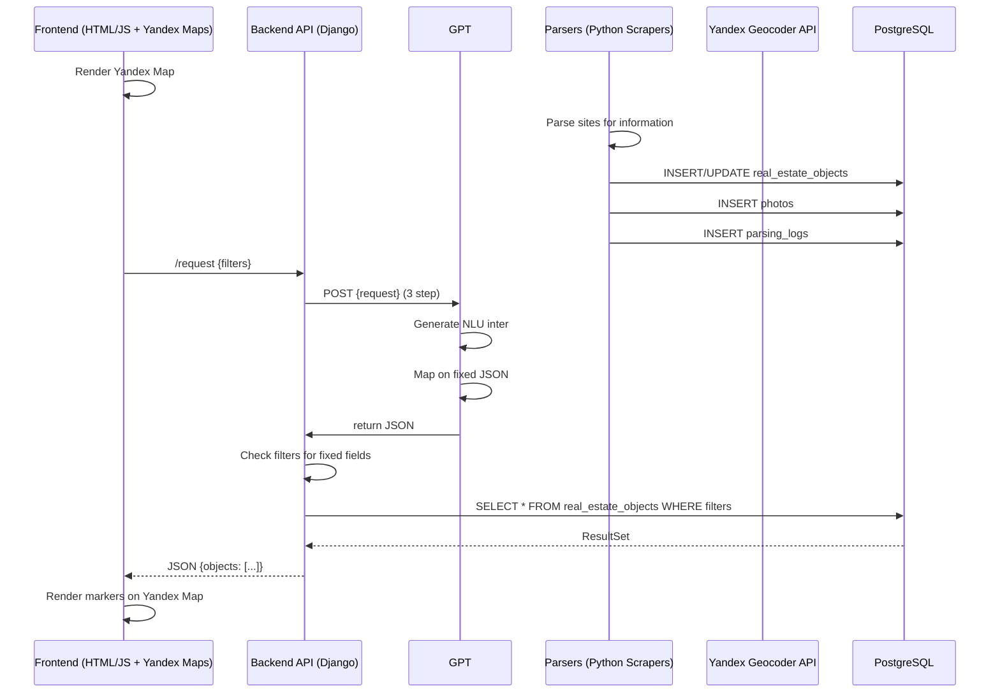

```mermaid
sequenceDiagram
    participant Front as Frontend (HTML/JS + Yandex Maps)
    participant API as Backend API (Django)
    participant AI as GPT
    participant Parser as Parsers (Python Scrapers)
    participant Geo as Yandex Geocoder API
    participant DB as PostgreSQL

    %% === Старт работы ===
    Front ->> Front: Render Yandex Map
    Parser ->> Parser: Parse sites for information
    Parser ->> DB: INSERT/UPDATE real_estate_objects # Put information in DB
    Parser ->> DB: INSERT photos
    Parser ->> DB: INSERT parsing_logs

    %% === Пользователь вводит требования банка ===
    Front ->> API: /request {filters}
    
    API ->> AI: POST {request} (3 step)
    AI ->> AI: Generate NLU inter
    AI ->> AI: Map on fixed JSON
    AI ->> API: return JSON
    API ->> API: Check filters for fixed fields


    %% === API запрашивает данные для фронта ===
    API ->> DB: SELECT * FROM real_estate_objects WHERE filters # Take information from DB, grouped by AI JSON
    DB -->> API: ResultSet

    %% === Ответ на фронт ===
    API -->> Front: JSON {objects: [...]}

    %% === Отображение на карте ===
    Front ->> Front: Render markers on Yandex Map

```
